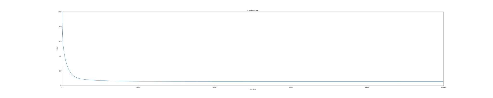
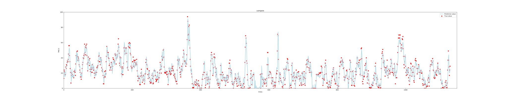

# 这里记录了我在机器学习路上的点滴。

## hw1是李宏毅老师的课后作业——天气预测。

### 下面是我做出来的Loss曲线图、预测值和真实值对比图:

### 首先说一下做机器学习的过程：
#### 1. Define function set(Model):
y = b + w1*(x1+x2+ ... +xi) + w2*(x1+x2+ ... +xi) +  ... + wi*(x1+x2+ ... +xi)

#### 2.Define loss function based on training data:
loss = np.sqrt(np.sum(np.power(np.dot(x, w) - y, 2)) / num_of_x), 其中y为真实值，num_of_x为x的个数 （均方根误差 Root Mean Squared Error，RMSE）

#### 3.Find the best function

##### 预测天气这是一个回归（Regression）问题。
##### 1.首先需要通过对数据对预先处理，通过滑动窗口（sliding window）的方法对数据分块；
##### 2.数据标准化（Normalize）通常使用归一化，然后把test data按比例划分为test data 和validation data，使用validation data可以简单对验证模型的好坏。

###### 参考：https://mrsuncodes.github.io/2020/03/15/%E6%9D%8E%E5%AE%8F%E6%AF%85%E6%9C%BA%E5%99%A8%E5%AD%A6%E4%B9%A0-%E7%AC%AC%E4%B8%80%E8%AF%BE%E4%BD%9C%E4%B8%9A/#more
###### 感谢Jack Huang的答疑与指导
